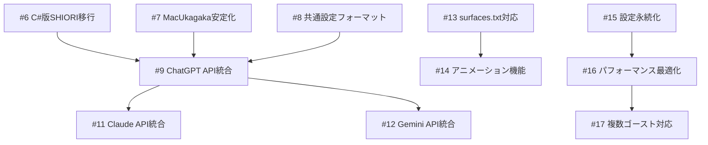

# GitHub Issues 作成完了サマリー

## 📋 実装計画に基づくイシュー作成完了

実装ロードマップに基づいて、12個のイシューと1個のマイルストーンを作成しました。

## 作成されたイシュー一覧

### 🔴 Phase 1: 基盤整備（High Priority）

| # | タイトル | 見積もり | 説明 |
|---|---------|---------|------|
| [#6](https://github.com/eightman999/AINanikaAIChan/issues/6) | C#版SHIORIの.NET Core移行 | 5-7日 | 既存C#コードをmacOS対応に移行 |
| [#7](https://github.com/eightman999/AINanikaAIChan/issues/7) | MacUkagakaの安定化と通信改善 | 3-5日 | SHIORI通信の安定性向上 |
| [#8](https://github.com/eightman999/AINanikaAIChan/issues/8) | 共通設定フォーマットの設計と実装 | 4-6日 | Windows/macOS共通設定 |

**Phase 1 完了予定**: 2週間（12-18日）

### 🟡 Phase 2: AI統合（Medium Priority）

| # | タイトル | 見積もり | 説明 |
|---|---------|---------|------|
| [#9](https://github.com/eightman999/AINanikaAIChan/issues/9) | ChatGPT API統合とAI抽象化レイヤー | 7-10日 | AI統合の基盤実装 |
| [#11](https://github.com/eightman999/AINanikaAIChan/issues/11) | Claude API統合 | 3-5日 | Claude APIサービス実装 |
| [#12](https://github.com/eightman999/AINanikaAIChan/issues/12) | Gemini API統合 | 3-5日 | Gemini APIサービス実装 |

**Phase 2 完了予定**: 2-3週間（13-20日）

### 🟢 Phase 3: 機能拡張（Low Priority）

| # | タイトル | 見積もり | 説明 |
|---|---------|---------|------|
| [#13](https://github.com/eightman999/AINanikaAIChan/issues/13) | surfaces.txt完全対応と高度画像合成 | 10-14日 | 複雑な画像合成機能 |
| [#14](https://github.com/eightman999/AINanikaAIChan/issues/14) | アニメーション機能実装 | 7-10日 | まばたき・口パク等 |
| [#15](https://github.com/eightman999/AINanikaAIChan/issues/15) | 設定永続化とウィンドウ位置保存 | 3-5日 | 設定の保存・復元 |

**Phase 3 完了予定**: 2-3週間（20-29日）

### 🟢 Phase 4: 最適化・拡張（Low Priority）

| # | タイトル | 見積もり | 説明 |
|---|---------|---------|------|
| [#16](https://github.com/eightman999/AINanikaAIChan/issues/16) | パフォーマンス最適化とメモリ管理 | 7-10日 | 性能向上とメモリ削減 |
| [#17](https://github.com/eightman999/AINanikaAIChan/issues/17) | 複数ゴースト対応システム | 10-14日 | 複数ゴーストの管理 |

**Phase 4 完了予定**: 1-2週間（17-24日）

### 📋 マイルストーン

| # | タイトル | 完了予定 | 説明 |
|---|---------|---------|------|
| [#18](https://github.com/eightman999/AINanikaAIChan/issues/18) | Phase 1 Milestone: 基盤整備完了 | 2週間後 | Phase 1完了管理 |

## 📊 プロジェクト統計

- **総イシュー数**: 12個
- **総見積もり時間**: 82-118日
- **実装フェーズ**: 4段階
- **優先度分布**: High(3), Medium(3), Low(6)

## 🎯 今週の重点タスク

実装計画に基づき、**Phase 1の3つのイシュー**を最優先で実施：

1. **#6 C#版SHIORI移行** - 既存AI機能の基盤
2. **#7 MacUkagaka安定化** - アプリケーションの安定性
3. **#8 共通設定フォーマット** - 設定管理の統一

## 🔄 依存関係

## 📈 成功指標

### Phase 1完了時
- [ ] macOS環境でのAI応答動作
- [ ] 24時間安定動作
- [ ] 既存機能の80%移植完了

### 全Phase完了時
- [ ] Windows版と同等の機能実現
- [ ] 3つのAIサービス完全統合
- [ ] アニメーション・高度画像合成対応
- [ ] 複数ゴースト同時実行

## 🛠️ 技術スタック

- **Frontend**: Swift + AppKit
- **Backend**: .NET 6/8 (クロスプラットフォーム)
- **AI APIs**: OpenAI GPT-4, Anthropic Claude, Google Gemini
- **Graphics**: Core Graphics, Core Animation
- **Data**: JSON設定, 暗号化APIキー

## 📝 次のアクション

1. **Phase 1開始**: Issue #6から着手
2. **週次レビュー**: 毎週の進捗確認
3. **問題解決**: ブロッカーの早期解決
4. **品質管理**: 各Phaseでの動作確認

このイシュー管理により、既存のAI何かちゃんの機能を段階的にmacOS版MacUkagakaに統合し、両プラットフォームで一貫した高品質な体験を提供できます。